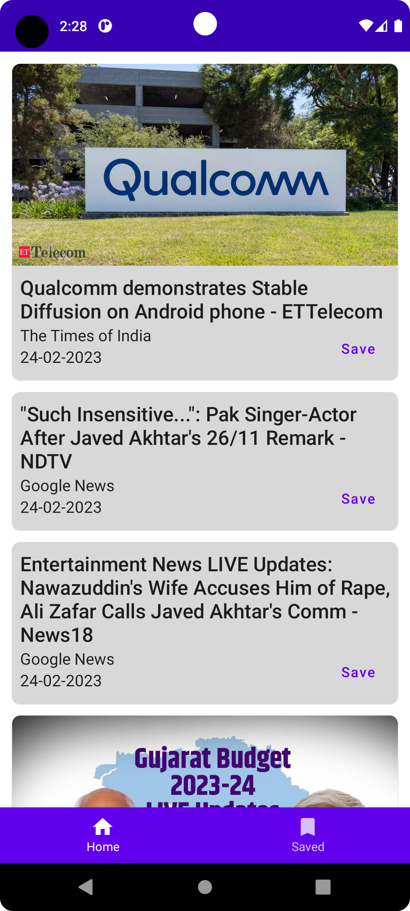
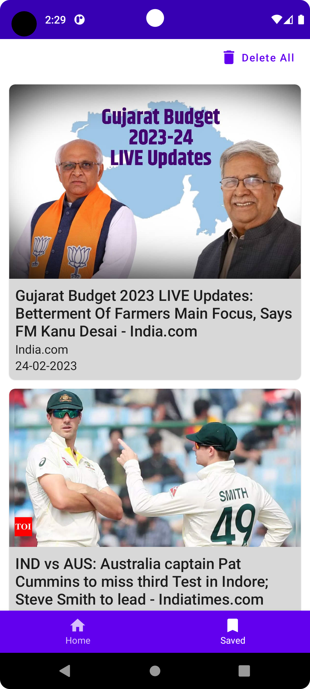

# Reactive News App


Android app that shows top headlines from News API and allows you to save for offline reading

# 📷 Previews
<!-- Download [apk](https://drive.google.com/file/d/1U4SNoN6jobaEwXyTJll-THSJO92tSafd/view?usp=share_link)-->
<p align="center">
  
  
  
</p>

# 🛠 Tech Sacks & Open Source Libraries

- Jetpack Compose
- ViewModel
- Hilt
- Compose Navigation
- Room
- DataStore
- Retrofit
- moshi

# File structure

<details>
    <summary>Click me</summary>

  ```
└───newsapp
    │   App.kt
    │   MainActivity.kt
    │
    ├───data
    │   ├───local
    │   │       ArticleDao.kt
    │   │       ArticleDatabase.kt
    │   │
    │   ├───mapper
    │   │       ArticleMapper.kt
    │   │
    │   ├───model
    │   │       ArticleEntity.kt
    │   │       ArticleResponse.kt
    │   │       NewsApiResponse.kt
    │   │       Source.kt
    │   │
    │   ├───remote
    │   │       NewsApi.kt
    │   │
    │   └───repository
    │           ArticleRepositoryImpl.kt
    │
    ├───di
    │       AppModule.kt
    │       DatabaseModule.kt
    │       RepositoryModule.kt
    │
    ├───domain
    │   └───repository
    │           ArticleRepository.kt
    │
    ├───presentation
    │   │   WebViewScreen.kt
    │   │
    │   ├───common
    │   │       ArticleCard.kt
    │   │
    │   ├───home_screen
    │   │       ArticleItem.kt
    │   │       HomeScreen.kt
    │   │       HomeScreenState.kt
    │   │       HomeScreenViewModel.kt
    │   │
    │   ├───navigation
    │   │       MainGraph.kt
    │   │       MainScreen.kt
    │   │       RootGraph.kt
    │   │       Screen.kt
    │   │
    │   └───saved_screen
    │           SavedArticleItem.kt
    │           SavedScreen.kt
    │           SavedScreenState.kt
    │           SavedScreenViewModel.kt
    │
    ├───ui
    │   └───theme
    │           Color.kt
    │           Shape.kt
    │           Theme.kt
    │           Type.kt
    │
    └───util
            Resource.kt
  ```

</details>

